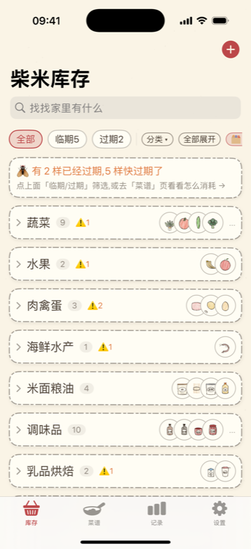
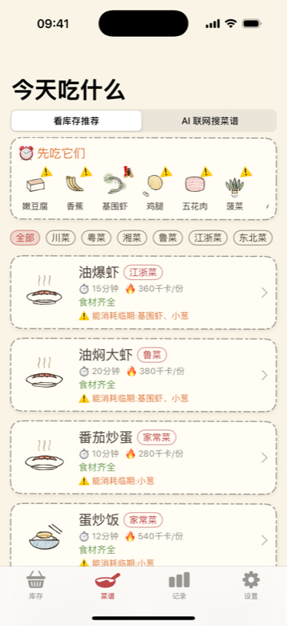
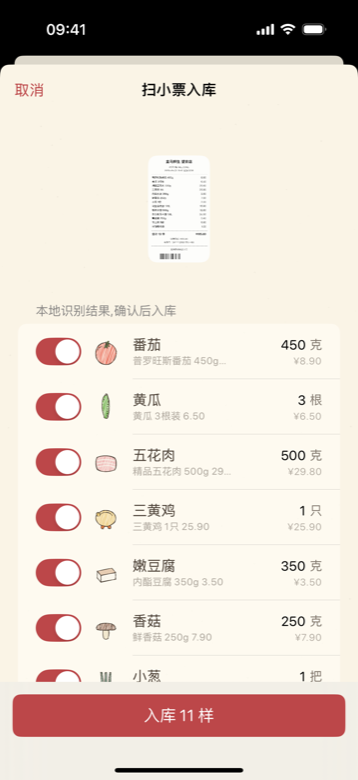
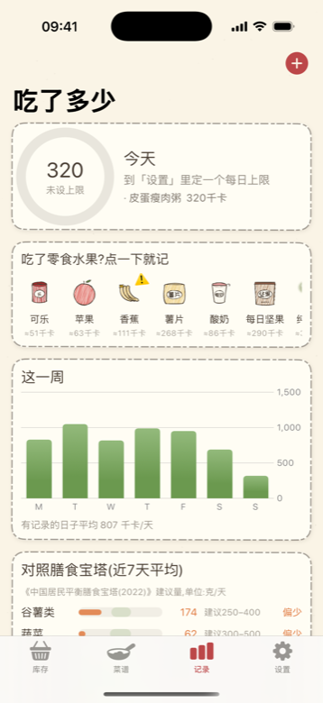

# 柴米 🧺

> 柴米油盐,先管柴米。

一个**手绘风格**的 iOS 家庭食材库存 App:扫购物小票入库、保质期提醒(临期⚠️/过期🪰动画)、按库存推荐菜谱、记卡路里、对照《中国居民平衡膳食宝塔(2022)》给建议。可选接入 Anthropic Claude API 做小票 AI 识别与联网搜菜谱。

| 库存 | 菜谱推荐 | 小票 OCR | 卡路里 & 宝塔 |
| --- | --- | --- | --- |
|  |  |  |  |

## 功能

> 开屏有 2 秒手绘落菜动画(点击可跳过);设置页支持 Sign in with Apple(本地身份,为将来 iCloud/家庭共享预留,需在 Signing & Capabilities 配置 Team)。


- **库存管理(核心)**
  - 内置 **190 种**中国家庭常见食材/调料目录(分类与 SKU 参考盒马、山姆、沃尔玛、多多买菜等平台):蔬菜、水果、肉禽蛋、海鲜水产、米面粮油、调味品、乳品烘焙、豆制品、菌菇、速冻主食、零食饮料,每种都有**程序生成的手绘图标**、别名表、默认单位、冷藏/常温/冷冻默认保质期、每百克热量、宝塔分组。
  - 入库即记保质期(按存放方式自动预填,可改);**临期(≤2天)**卡片上弹跳 ⚠️,**过期**图标自动黑灰化+长霉斑+苍蝇 🪰 绕圈动画,名称划线。
  - 按分类/临期/过期筛选,搜索,点卡片改数量、换存放方式、"用掉 1 份 / 吃完扔掉",零食水果可直接"吃掉 → 记卡路里"。
- **三种入库方式**
  1. **扫小票(离线)**:Apple Vision OCR(中文)→ 同行名称/价格合并 → 规则引擎过滤"合计/会员/购物袋"等杂项、抽取数量单位价格 → 别名匹配目录 → 可编辑确认单(未匹配行可手动指定)。
  2. **拍食材(离线)**:Vision 图像分类,映射到目录候选。
  3. **手动添加**:190 种目录网格浏览 + 搜索。
  - 配了 API Key 后,任何图可用 **Claude 视觉**重新识别(准确率更高,支持任意小票版式)。
- **🎰 老虎机摇菜(拟物)**:木纹机身、闪灯招牌、圆筒转轮窗,右侧**可拖拽的红球拉杆**(拽过 60% 松手开摇、弹簧回弹);程序合成的 8-bit 音效(拉杆咔嚓/转轮嗒嗒由密到疏、重音对准停轮/出票滋滋+叮/盖章咚,跟随静音拨片,机身可静音);停轮后凭证从**出票口打印着伸出来**,红印"咚"地盖下。可筛 肉菜/素菜/热菜/冷菜/面食/米饭,落点永远对应一道真实可做的菜(库存齐全、消耗临期加权),不满意旧票飞走再摇。
- **菜谱推荐**
  - 内置 **52 道**家常菜谱(川/粤/湘/鲁/江浙/东北/西北/家常),按"主料在库覆盖率 + 是否消耗临期食材"打分排序,顶部横排提示"先吃它们"。
  - 菜谱详情:主料 ✅/🛒 对照库存、调料有缺标色、步骤;**"做好了"一键扣库存 + 按份数记卡路里**(调料默认不扣)。
  - **AI 联网搜菜谱**:选菜系 + 勾库存食材(临期默认勾上)→ Claude `web_search` 搜下厨房/豆果等中文菜谱站 → 返回带**来源链接**的菜谱卡,同样支持一键记录。
- **过期提醒**:设置里打开「到期前一天提醒我」并选时间,每天最多推送一条,聚合列出明天到期的食材(来不及提前说的当天补报);改库存后自动重排,点通知直达库存临期筛选。
- **Apple 健康联动**:只读 `activeEnergyBurned`/`basalEnergyBurned`(HKStatisticsCollectionQuery 按天聚合),两种预算模式——固定上限,或**「跟随健康」:今日预算 = 基础代谢 + 当天运动消耗 + 目标盈亏,随运动实时上调**(下限 1200);周图升级为摄入柱 vs 消耗线对照,给出本周净盈亏并换算脂肪克数(7700 千卡≈1kg);可让 Claude 根据 7 天摄入+消耗出一个建议预算,一键应用。模拟器用 `-demoHealth` 注入仿真数据。
- **卡路里与膳食建议**
  - 设置页输入身体参数(性别/年龄/身高/体重/活动水平/减脂目标),用 **Mifflin-St Jeor** 公式算 BMR/TDEE,一键把每日上限设为目标值(减脂下限 1200)。
  - 今日环形进度、本周柱状图(Swift Charts,超上限标红)、近 7 天**平衡膳食宝塔对照条**(谷薯/蔬菜/水果/畜禽/水产/蛋/奶/豆坚果/油,显示建议区间与偏少/合适/偏多)。
  - 离线规则建议 + 可选 **Claude 营养师点评**。
- **全手绘视觉**:243 张图标全部由 `rough.js` 程序化生成(抖动描边 + 排线填充),包装类画罐/瓶/袋再用手写体写"盐/醋/豆瓣/米"标签;全局使用 OFL 开源手写字体**站酷快乐体**;米纸底色 + 虚线卡片。

## 项目构造

```
chaimi/
├── project.yml                  # XcodeGen 工程定义(xcodeproj 由它生成)
├── Chaimi/
│   ├── App/
│   │   ├── ChaimiApp.swift      # @main,SwiftData ModelContainer,示例数据
│   │   └── Theme.swift          # 手绘主题:字体/纸面/虚线卡片/过期腐烂动画
│   ├── Models/
│   │   ├── Catalog.swift        # 食材目录加载 + 规范化别名匹配(OCR 用)
│   │   ├── LocalRecipe.swift    # 内置菜谱库 + 分组克数估算
│   │   ├── PantryItem.swift     # SwiftData @Model,保质期状态机(fresh/expiring/expired)
│   │   ├── CalorieEntry.swift   # SwiftData @Model,含宝塔分组克数(JSON)
│   │   └── BodyProfile.swift    # 身体参数、BMR/TDEE、宝塔(2022)区间与离线建议
│   ├── Services/
│   │   ├── OCRService.swift     # Vision 文字识别(同行合并)+ 图像分类→目录映射
│   │   ├── ReceiptParser.swift  # 小票规则引擎:杂项过滤/价格/数量单位/别名匹配
│   │   ├── ClaudeAPI.swift      # Messages API 直连:视觉抽取/联网搜菜谱/营养点评
│   │   ├── RecipeRecommender.swift # 覆盖率+临期加权推荐
│   │   └── KeychainStore.swift  # API Key 存取(kSecClassGenericPassword)
│   ├── Views/                   # SwiftUI:库存/目录/扫描/菜谱/AI搜索/记录/设置
│   ├── Resources/
│   │   ├── catalog.json         # 190 种食材(单一数据源,图标生成器也读它)
│   │   ├── recipes.json         # 52 道菜谱(id 引用 catalog,测试校验)
│   │   └── SampleReceipt.png    # 生成的模拟小票,模拟器里无相机也能演示 OCR
│   ├── Fonts/                   # 站酷快乐体 + OFL 许可证
│   └── Assets.xcassets/         # 243 张生成的手绘 PNG + AppIcon + 色板
├── ChaimiTests/                 # 15 个单元测试(数据完整性/解析/推荐/营养计算)
├── tools/
│   ├── gen-icons.mjs            # rough.js → SVG → resvg → PNG 图标流水线(50+ 模板)
│   └── gen-receipt.mjs          # 模拟小票生成
└── docs/screenshots/            # 模拟器实拍截图
```

### 技术选型

| 层 | 选择 | 说明 |
| --- | --- | --- |
| UI | SwiftUI(iOS 17+) | 动画用 `repeatForever`;图表 Swift Charts |
| 持久化 | SwiftData | `PantryItem` / `CalorieEntry` 两个 @Model;目录和菜谱是只读 JSON 资源 |
| OCR/分类 | Apple Vision | `VNRecognizeTextRequest(zh-Hans)` + `VNClassifyImageRequest`,**全离线** |
| AI(可选) | Anthropic Messages API | URLSession 直连,无第三方 SDK/服务器 |
| 密钥 | Keychain | 只存本机,不进 iCloud(`ThisDeviceOnly`) |
| 美术 | rough.js + resvg + 站酷快乐体 | 构建期生成,运行时零依赖 |
| 工程 | XcodeGen | `project.yml` 进版本库,`.xcodeproj` 可随时重新生成 |

### Claude API 集成细节

全部走 `POST https://api.anthropic.com/v1/messages`,headers:`x-api-key` / `anthropic-version: 2023-06-01`。默认模型 `claude-opus-5-5`(设置里可换 `claude-sonnet-5-5` / `claude-haiku-4-5`)。

1. **小票/食材视觉识别**:图片压到长边 ≤1800 的 JPEG 以 base64 `image` block 发送(图在前、文字提示在后),用**结构化输出** `output_config.format = {type: "json_schema"}` 保证返回合法 JSON(`items[{name, catalogId, quantity, unit}]`),提示词里附 190 条目录速查表让模型直接对齐 `catalogId`。
2. **联网搜菜谱**:两步调用。第一步挂服务端工具 `{"type":"web_search_20250305","name":"web_search","max_uses":5}`,遇 `stop_reason == "pause_turn"` 按文档把 assistant 内容原样回传续跑(≤3 跳),从 `citations` 和 `web_search_tool_result` 收集来源;第二步把文本交给**无工具**的结构化输出调用整理成菜谱 JSON——因为 API 规定引用(citations)与结构化输出不能同用,拆成两步最稳。
3. **营养点评**:system prompt 内嵌宝塔(2022)建议量,输入身体参数 + 近 7 天分组摄入汇总。
4. 错误处理:401/429/529 分类映射中文提示;HTTP 200 但 `stop_reason:"refusal"` 单独处理。
5. **费用参考**:一张小票识别约 2.5k 输入 token(高清小票 ≈1.5k 视觉 token)≈ **人民币几分钱**;一次联网搜菜谱(Opus 5.5 + 3~5 次搜索,web_search 定价 $10/千次)≈ **¥0.3~0.8**;换 Haiku 更省。

### 隐私

- 库存、卡路里、身体参数全部**只存在手机本地**(SwiftData/UserDefaults/Keychain),无任何自建服务器、无埋点。
- 离线模式(不填 Key)什么都不上传;填了 Key 后,仅在你主动点"AI 识别/AI 搜菜谱/AI 点评"时,把那张图片或饮食摘要直接发给 Anthropic API。

### 需要后端吗?(Supabase 结论)

**v1 不需要,刻意做成了零后端。** 单人单机场景下,SwiftData + Keychain 已覆盖全部需求,少一个后端就少一份运维、延迟与隐私暴露面。将来如果要做这两件事再上 Supabase:

1. **家庭共享库存 / 多设备同步**:建 `pantry_items`、`calorie_entries` 两张表 + RLS(按 household_id 隔离),客户端把 SwiftData 当本地缓存做双向同步;匿名登录 + 邀请码即可。
2. **把 Claude 调用挪到服务端**(Edge Function 持有 API Key,App 不再存 Key),顺便做用量限额。

在那之前,苹果自家的 **CloudKit + SwiftData(iOS 17 自带)** 是更省事的同设备账号同步选项,改一行 `ModelConfiguration` 即可,缺点是只限 iCloud、没法共享给家人安卓设备。

## 构建与运行

```bash
# 依赖:Xcode 16+;XcodeGen(生成工程);Node 18+(仅当你要重新生成图标)
xcodegen generate                 # 由 project.yml 生成 Chaimi.xcodeproj
open Chaimi.xcodeproj             # Xcode 里选 iPhone 模拟器直接 ⌘R
```

命令行构建/测试:

```bash
xcodebuild -project Chaimi.xcodeproj -scheme Chaimi \
  -destination 'platform=iOS Simulator,name=iPhone 16 Pro' test
```

重新生成全部手绘图标和示例小票(改 `catalog.json` 的 `icon` 字段后):

```bash
cd tools && npm install && node gen-icons.mjs && node gen-receipt.mjs
```

模拟器演示参数:`-demoData`(示例库存)、`-demoTab N`(直达某页)、`-demoScan`(自动演示小票 OCR)、`-demoNotify`(排演过期提醒)、`-demoSlot`(自动摇一次老虎机)、`-demoSplash`/`-noSplash`(演示/跳过开屏)。

## 测试

`ChaimiTests` 共 15 个用例:目录 id 唯一性/分类合法性/**每条目录都有图标资源**、菜谱全部引用可解析、`ReceiptParser` 对样例小票的匹配与数量/价格抽取(含 1.5斤→750克)、保质期状态机、BMR/TDEE 与 1200 下限、宝塔判定、推荐引擎"临期优先"与菜系过滤、目录别名匹配。

## 数据来源与致谢

- 膳食建议量:《中国居民平衡膳食宝塔(2022)》,中国营养学会([修订说明](http://dg.cnsoc.org/article/04/RMAbPdrjQ6CGWTwmo62hQg.html)[解析](https://m.thepaper.cn/newsDetail_forward_21109641));本 App 的建议仅供参考,不构成医疗意见。
- 食材热量为常见食物成分表近似值,按 100g 可食部估算。
- 手写字体:[站酷快乐体 ZCOOL KuaiLe](https://github.com/googlefonts/zcool-kuaile),SIL OFL 1.1。
- 手绘渲染:[rough.js](https://roughjs.com/)(MIT);PNG 栅格化:[resvg-js](https://github.com/yisibl/resvg-js)(MPL-2.0),均仅用于构建期。

## Roadmap

- [x] 过期前一天本地推送提醒(UNUserNotificationCenter,每日聚合一条)
- [ ] AI 搜到的菜谱收藏为本地菜谱
- [ ] 按周出"该买什么"购物清单(反向:菜谱 − 库存)
- [ ] CloudKit 同步 / Supabase 家庭共享
- [ ] 条形码扫码入库(VisionKit DataScanner)

## License

MIT © Yanbo Wang(字体与第三方库遵循各自许可证)
